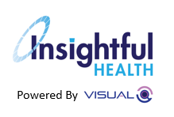
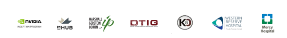
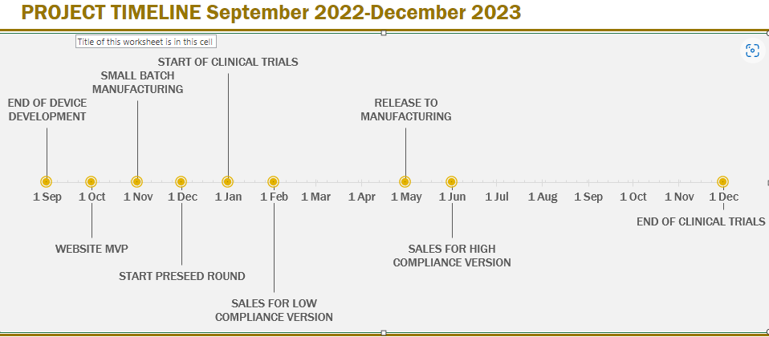
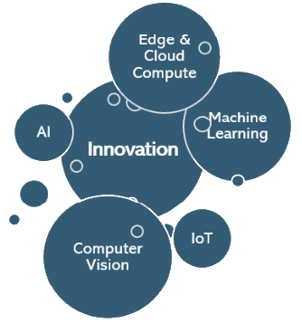
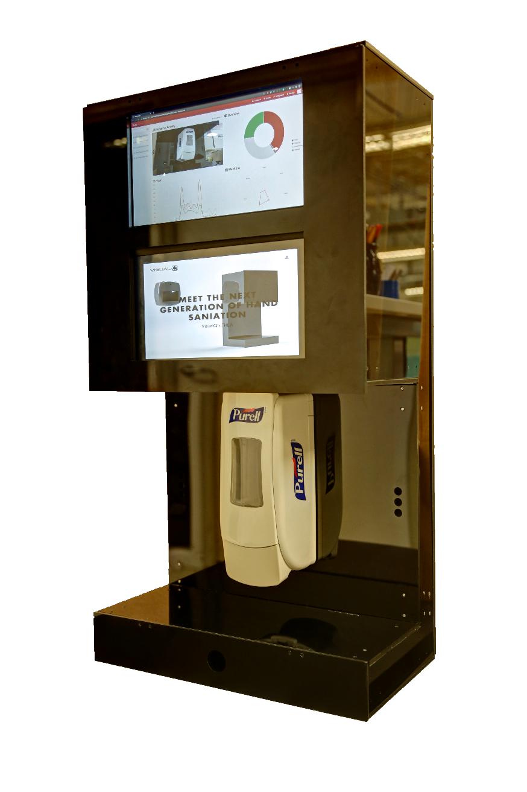
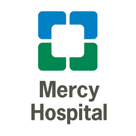

{width="2.3270352143482063in"
height="1.0864468503937008in"}{width="8.4625in"
height="1.7014916885389326in"}

{width="8.527771216097987in"
height="5.716418416447944in"}

{width="8.487722003499563in"
height="4.379214785651794in"}{width="2.566666666666667in"
height="0.5520833333333334in"}{width="2.5368055555555555in"
height="0.5520833333333334in"}{width="2.8506944444444446in"
height="0.5520833333333334in"}\
Our Leadership

+--------------------+-------------------------------------------------+
| {width="0.7 |                                                 |
| 916666666666666in" | *Chief Executive Officer*                       |
| height="0.79       |                                                 |
| 16666666666666in"} |                                                 |
+====================+=================================================+
| {width="0.7 |                                                 |
| 916666666666666in" | *Co-Founder*                                    |
| height="0.79       |                                                 |
| 16666666666666in"} |                                                 |
+--------------------+-------------------------------------------------+
| {width="0.7 |                                                 |
| 916666666666666in" | *Co-Founder*                                    |
| height="0.79       |                                                 |
| 16666666666666in"} |                                                 |
+--------------------+-------------------------------------------------+

Our Partners

  ------------------------------------------------------------------------------------------------------------------------------------------------------------------
  {width="1.9216721347331585in"   {width="0.9826388888888888in"   {width="1.85in"
  height="0.6574136045494313in"}                        height="0.7930555555555555in"}                         height="1.1527777777777777in"}
  ----------------------------------------------------- ------------------------------------------------------ -----------------------------------------------------
  {width="1.4645833333333333in"   {width="1.5673611111111112in"    {width="1.6291666666666667in"
  height="0.49375in"}                                   height="0.9201388888888888in"}                         height="0.4375in"}

  ------------------------------------------------------------------------------------------------------------------------------------------------------------------

# Contents {#contents .TOC-Heading}

[Company Highlights [3](#company-highlights)](#company-highlights)

[Executive Summary [4](#executive-summary)](#executive-summary)

[Problem [6](#problem)](#problem)

[Solution [8](#solution)](#solution)

[Market Opportunity [9](#market-opportunity)](#market-opportunity)

[Competitive Advantages
[10](#competitive-advantages)](#competitive-advantages)

[Corporate Structure [11](#corporate-structure)](#corporate-structure)

[Our Beginnings [12](#our-beginnings)](#our-beginnings)

[mHUB Partnership [12](#mhub-partnership)](#mhub-partnership)

[Thea Prototype & Proof of Concept
[13](#thea-prototype-proof-of-concept)](#thea-prototype-proof-of-concept)

[Pre-Pilot [14](#pre-pilot)](#pre-pilot)

[Current State & Steps to Market
[15](#current-state-steps-to-market)](#current-state-steps-to-market)

[Appendix [16](#appendix)](#appendix)

[Our Partners [17](#our-partners)](#our-partners)

[Citations and Sources
[18](#citations-and-sources)](#citations-and-sources)

[References [18](#_Toc51967904)](#_Toc51967904)

This business plan is presented to those who are seeking to invest
capital or form strategic partnerships with us at Insightful Health.
This plan and has been updated frequently since January 2018.

# Company Highlights

+----------------------------+-----------------+-----------------------+
| Founded:                   | 2018            |                       |
+============================+=================+=======================+
| Headquarters:              | Chicago, IL     |                       |
+----------------------------+-----------------+-----------------------+
| Initial Seed:              | \$250,000       |                       |
+----------------------------+-----------------+-----------------------+
|                            |                 |                       |
+----------------------------+-----------------+-----------------------+
|                            |                 |                       |
+----------------------------+-----------------+-----------------------+
| Patents Pending:           | 1               |                       |
+----------------------------+-----------------+-----------------------+
| Awards:                    | 2nd place --    |                       |
|                            | MHUB 2020       |                       |
|                            | Venture         |                       |
|                            | Challenge       |                       |
+----------------------------+-----------------+-----------------------+
| Corporate Partnerships:    | nVidia, mHUB,   |                       |
+----------------------------+-----------------+-----------------------+
|                            |                 |                       |
+----------------------------+-----------------+-----------------------+
|                            |                 |                       |
+----------------------------+-----------------+-----------------------+
| US Market Size (Est):      | \$100.1 --      |                       |
|                            | 250.4 billion   |                       |
+----------------------------+-----------------+-----------------------+
| Target Markets:            | Restaurants     | Parks                 |
|                            |                 |                       |
|                            | Hospitality     | Civil Offices         |
|                            |                 |                       |
|                            | Healthcare      | Food Prep             |
|                            |                 |                       |
|                            | Retail Stores   | Gyms and Fitness      |
|                            |                 | Facilities            |
|                            | Clinical        |                       |
|                            | Environments    | Stadiums              |
|                            |                 |                       |
|                            | Schools         |                       |
+----------------------------+-----------------+-----------------------+

# {width="2.2569444444444446in" height="2.4194444444444443in"}Executive Summary

Insightful Health is a Chicago-based startup company focusing on
introducing and spreading hand sanitation and safety throughout the
globe.

At present, we have developed a business model alongside proprietary
protections

that can detect and respond to hand sanitation incidents "at edge." Our
technology detects and then encourages hand sanitation compliance in
almost any environment.

By utilizing a variety of innovative and psychological approaches, we
can increase the cumulative hand sanitation rate in any communal area
while simultaneously restoring confidence in the safety of public
spaces, especially in the era of COVID-19.

During this time of uncertainty, our product is perfectly positioned to
penetrate a broad spectrum of hungry markets; all the while utilizing an
array of sales, marketing, and revenue channels.

We can save lives by

promoting hand sanitation awareness

and raising compliance rates

while utilizing unique marketing tactics

and a multi-pronged revenue strategy

to achieve short and long-term commercial viability.

## Problem

For almost 200 years, the scientific and medical communities have
pioneered hand washing protocols as one of the 4 pillars of infection
prevention and control.

Proper hand sanitation protocols have been credited with other,
significant health benefits:

-   minimizing the spread of influenza, coronavirus, and
    other infectious diseases;

-   preventing infectious causes
    of diarrhea;[\[12\]](https://en.wikipedia.org/wiki/Hand_washing#cite_note-cdwt-12) 

-   decreasing respiratory
    infections;[\[13\]](https://en.wikipedia.org/wiki/Hand_washing#cite_note-pcda-13) 

-   and reducing infant mortality rate at home
    birth deliveries.[\[14\]](https://en.wikipedia.org/wiki/Hand_washing#cite_note-14)

Despite the clear evidence that hand washing is one of the pillars of
infection prevention and control, public compliance around hand
sanitation is severely lacking. The healthcare industry, the de facto
leaders in hand sanitation, only achieve an estimated rate of 36%
compliance, while most standards call for 90% or above!

The lack of adherence has considerable social and economic consequences:

-   On an annual basis, conservative estimates that hand washing can
    save at least 1 million lives nationally.

-   Within healthcare US hospitals are estimated to lose \$30 billion
    due to the financial impact of Hospital Acquired Infections, while
    global costs are estimated at \$15 trillion annually.

The COVID-19 pandemic will likely end up costing between \$8.1 and
\$15.8 trillion globally.

-World Economic Forum

## Solution

Thea is a patent pending IoT Device which combines a number of
technologies to detect and respond to hand sanitation incidents at Edge.

-   Predicts if a subject is adhering to hand hygiene protocols in
    real-time

-   Proactively warns and prompts for hand sanitation if compliance is
    not occurring

-   If violation occurs, logs the incident for further policing

-   Provides reports detailing key performance indicators and deeper
    metrics for process improvement

-   Non-intrusively changes human behavior

{width="3.972916666666667in"
height="5.965277777777778in"}

## Market Opportunity

Increasing hand sanitation from the current estimate of 36% to the
recommended 90% compliance rate would save 900,000 lives globally a
year. Additionally, \$11.5 trillion in healthcare costs would be
eliminated.

The total market size for HAI is projected to be at \$1.10 -2.54
billion/year in the US alone. At thousands of occurrences each day, each
missed opportunity will cost the hospital anywhere between \$25 -- 75.

The average 200-bed hospital will pay an estimated \$3.56 million/year
in HAI-related costs due to hand hygiene non-compliance. A single
infection of MRSA can cost a hospital over \$30K.

## Competitive Advantages

We are bringing to market a pioneering system that has advantages over
insufficient and antiquated solutions from current marketplace
competitors by providing the following innovations:

-   The first real-time compliance mechanism

-   The first in predictive notifications

-   The first device that gets more accurate over time by learning by
    itself

-   The first automated device with high-detection precision

-   High accuracy in monitoring and data reporting in the field

-   Lower implementation costs through employee self-onboarding

-   Visitor compliance possible

-   Easily scalable

-   Low total cost of ownership

-   HIPAA-compliant

{width="4.872222222222222in"
height="2.354861111111111in"}

# Corporate Structure

Equity

Voting

# Our Beginnings

## mHUB Partnership

In late 2018, we were accepted into the incubator and accelerator
program at mHUB.

mHUB fosters connections between local manufacturers, university
researchers and the entrepreneurial community of makers and
technologists. By galvanizing these connections, mHUB ensures that US
manufacturing industry continues to grow, lead, and reduce the cost and
barriers to entry for physical product innovation.

For these, and the following reasons, we chose mHUB over several other
incubators and accelerators, such as yCombinator and Matter Health. We
have since benefited greatly from this relationship in the areas of
product engineering, system design, and overall entrepreneurial
consulting. This partnership has been instrumental to the transition
from concept to a marketable product.

In February, we received 2^nd^ place and our first grant competing in
the 2020 mHUB Venture Challenge. This award is considered one of the
highest honors for a startup in the technology & manufacturing industry.

## Thea Prototype & Proof of Concept

A hand sanitation monitoring and compliance system, codenamed Thea, is
born.

Thea is a patent-pending system of IoT devices which combines AI,
Computer Vision, and Deep Learning "at edge" (directly on the device) to
detect and respond to hand sanitation incidents. Because of this
feature, Thea has the ability to affect hand hygiene compliance in
real-time using methods that were previously unfeasible.

At its core, Thea has the ability to monitor subjects and proactively
encourage hand sanitation in real-time. In a controlled environment,
Thea was successful in ingesting real-life images and determining if
hand sanitation was occurring at an almost 90% success rate.

## Pre-Pilot

In May of 2019, Thea underwent a pre-pilot involving 2 hospitals\* in
the Cleveland area. Both hospitals are considered medium-sized with
around 200 beds each. Reported data from hospital leadership suggested
that the cumulative hand sanitation rate (CHSR) was ***consistently
above 90%.***

On separate days at each location, four devices were set up and ran for
20 cumulative hours (40 hours in total)

Our devices collected image streams of everyday hospital activities

Our Deep Learning model extracted hand sanitation compliance incidents
vs other hospital activities and then processed the incidents

A CHSR was calculated using our algorithm

The CHSR was validated through human observation and manual tallying,
proving our algorithm's accuracy.

To reiterate, current and antiquated measurement methods such as
self-reporting and secret observers caused hospital administrators to
believe their CHSR was significantly higher than the actual percentage.

In our limited testing, we calculated the actual CHSR to be at 22%!

## Current State & Steps to Market

Patent pending

Current state is 5 employees

Pre-Pilot results

STEPS TO MARKET

-   Increasing Theas accuracy and precision to \~99%

-   Clinical Trials

-   Continuing Development

-   Manufacturing relationships

-   Distribution logistics

-   Facilitating customer installation and onboarding

-   While Continuing to grow

-   Cloud Platform

-   Sales

-   Marketing

-   Legal

# Appendix

No table of figures entries found.

## Our Partners

  --------------------------------------------------------------------------------------------------------
  {width="1.4097222222222223in"    *The NVIDIA Inception Program nurtures
  height="0.48333333333333334in"}                        cutting-edge AI startups who are revolutionizing
                                                         industries. This virtual accelerator offers
                                                         go-to-market support, expertise, and technology
                                                         for program members through deep learning
                                                         training, exclusive Inception events, GPU
                                                         discounts, and more.*
  ------------------------------------------------------ -------------------------------------------------
  {width="0.7989599737532809in"   *mHUB exists to ensure that the Midwestern
  height="0.6447364391951006in"}                         manufacturing industry continues to accelerate,
                                                         grow and thrive. mHUB is the nation\'s largest
                                                         and fastest-growing innovation center focused on
                                                         physical product development and manufacturing.*

  {width="1.6055555555555556in"   *Marshall, Gerstein & Borun LLP provides
  height="1.0in"}                                        sophisticated intellectual property advice and
                                                         legal services to many of the world's largest,
                                                         most innovative businesses, research
                                                         institutions, universities, and entrepreneurs.*

  {width="1.4503258967629047in"    *VisualQ delivers quality Research & Development
  height="0.49010061242344705in"}                        and Intellectual Property strategy and tactics in
                                                         the fields of Computer Vision, Artificial
                                                         Research, and Deep Learning*

  {width="1.4472222222222222in"    *DTIG is composed of some of the top consultants
  height="0.3888888888888889in"}                         and leaders in the business and cloud
                                                         integration. Their focus on revolutionizing all
                                                         business-transformation within large-scale
                                                         enterprises is evident in the wide spectrum of
                                                         services*
  --------------------------------------------------------------------------------------------------------

## Citations and Sources

# References

CDC. (1992). Public Health Focus: Surveillance, Prevention and Control
of Nosocomial Infections. . *Morbidity and Mortality Weekly Report* ,
41(42):783--787.

Cowling, B. J., & al., e. (2009, October 6). Facemasks and Hand Hygiene
to Prevent Influenza Transmission in Households. *Annals of Internal
Medicine*, 437-46. doi:10.7326/0003-4819-151-7-200910060-00142

Dangour, A. D. (1996). \"Interventions to improve water quality and
supply, sanitation and hygiene practices, and their effects on the
nutritional status of children\". *Reviews*.
doi:10.1002/14651858.CD009382.pub2

Luby, S. P., Agboatwalla, M., Painter, J., Altaf, A., Billhimer, W.,
Keswick, B., & Hoekstra, R. M. (2006). \"Combining drinking water
treatment and hand washing for diarrhoea prevention, a cluster
randomized controlled trial\". *Tropical Medicine & International
Health*. doi:10.1111/j.1365-3156.2006.01592.x

Rhee, V., Mullany, L. C., Khatry, S. K., Katz, J., Leclerq, S. C.,
Darmstadt, G. L., & Tielsch, J. M. (2008). Impact of Maternal and Birth
Attendant Hand-washing on Neonatal Mortality in Southern Nepal. *Arch
Pediatr Adolesc Med*, 603--08. doi:10.1001/archpedi.162.7.603

Scott, B., & al., e. (2009, June 28). Protecting Children from Diarrhoea
and Acute Respiratory Infections: The Role of Hand Washing Promotion in
Water and Sanitation Programmes. Retrieved from
http://www.searo.who.int/LinkFiles/Regional_Health_Forum_1.pdf#page=49

World Health Organization. (2020). *Getting your workplace ready for
COVID-19.* Retrieved March 27, 2020, from
https://www.who.int/docs/default-source/coronaviruse/getting-workplace-ready-for-covid-19.pdf

## Scratch Pad

A 2013 study even showed that improved hand washing practices may lead
to small improvements in the length growth in children under five years
of age![\[15\]](https://en.wikipedia.org/wiki/Hand_washing#cite_note-15)
